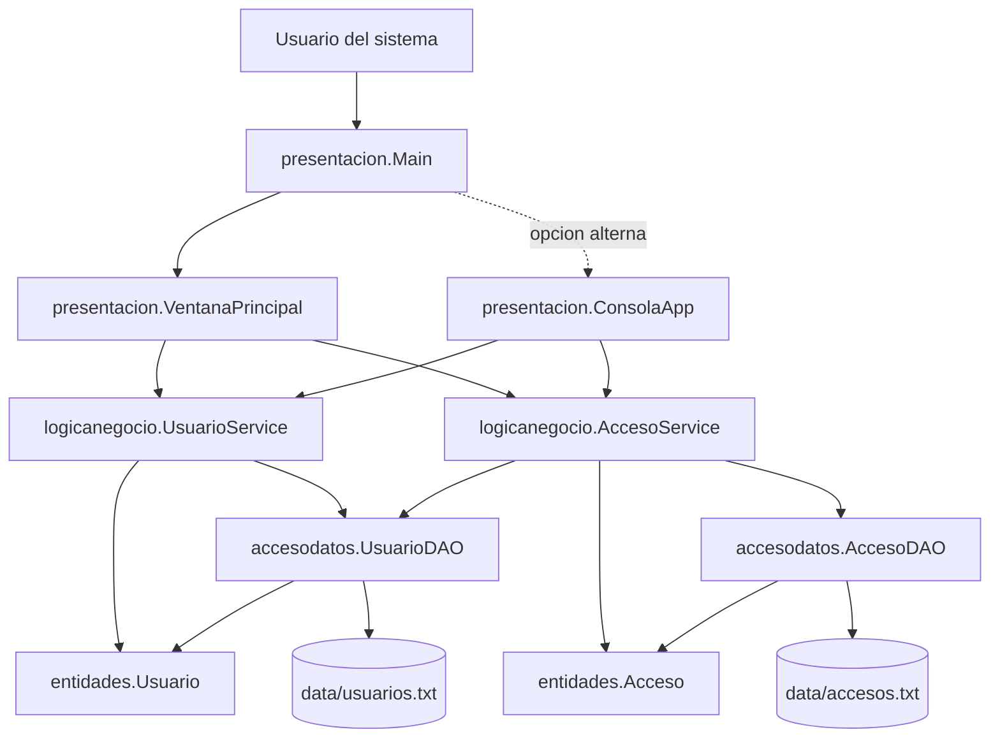
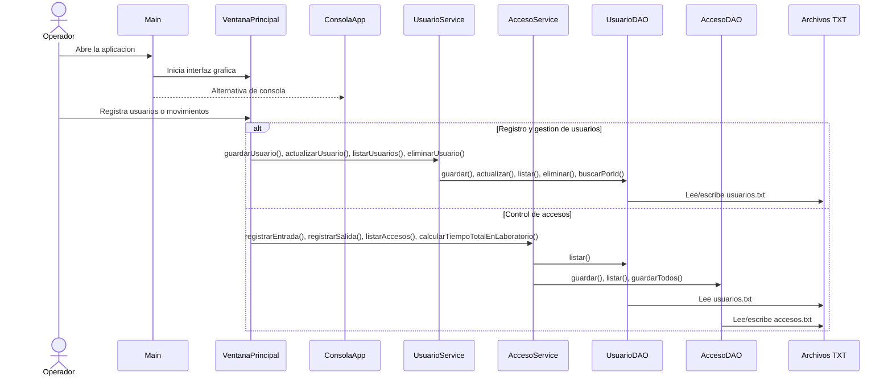

# Diagrama del Proyecto

Este documento resume la estructura actual del sistema y como se comunican sus capas principales.

## Arquitectura General



## Flujo de Operacion



## Responsabilidad por Capa

- `presentacion`: abre la interfaz Swing, mantiene una alternativa de consola y presenta resultados al usuario.
- `logicanegocio`: valida reglas del sistema, evita duplicados y controla accesos activos.
- `accesodatos`: persiste la informacion en archivos de texto dentro de `data/`.
- `entidades`: define los objetos de dominio `Usuario` y `Acceso`.

## Relacion Entre Clases

```text
Main
|- inicia -> VentanaPrincipal
|- opcion alterna -> ConsolaApp
|
VentanaPrincipal
|- usa -> UsuarioService
|  |- usa -> UsuarioDAO
|  |- crea/retorna -> Usuario
|
|- usa -> AccesoService
   |- usa -> UsuarioDAO
   |- usa -> AccesoDAO
   |- crea/retorna -> Acceso

ConsolaApp
|- usa -> UsuarioService
|- usa -> AccesoService

UsuarioDAO <-> data/usuarios.txt
AccesoDAO  <-> data/accesos.txt
```
